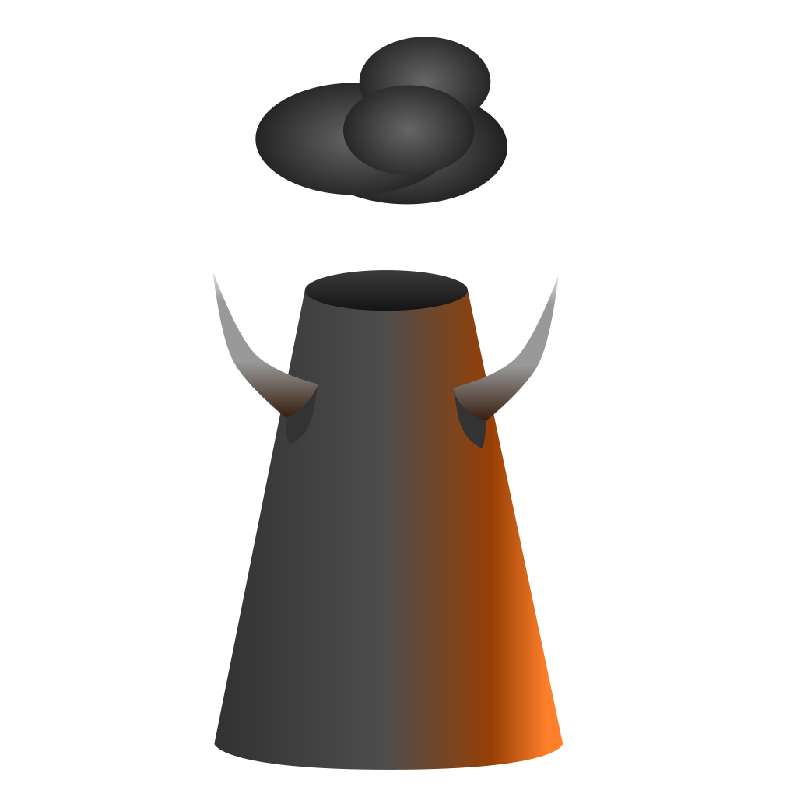

# About Indusferno

-----

## The Creative Pitch.

*"If Doom and OpenTTD had a child, it would be Indusferno... And it would
be nasty and full of monsters. And also very monopolistic."*

This is a partial conversion themed around the art of moving cargo
around, truly an industry in its own right. Capitalist Doomguy realizes
there is potential in Hell to make money, and much more than he could
have imagined; and now he wants to make the most out of his hellish
adventures as he can.

To this end, he will set up a transport network, funneling monsters
into death traps to harvest cargo from them, and moving cargo around
between industries to make more money and even new, processed kinds of
cargo!

Watch your empire rise, as the money keeps trickling in from all sides
of your enterprise; or be a moron, and fail absolutely at moving any
cargo, while your company is devoured by unpayable debts and ultimately
dissolved, and back into the ground whence it rose. The choice is
yours! [But you'll probably prefer the former! I'd bet!]

Who would know those weird types were so ingenious in the
industrialization of the underworld.

## The Vision and the Goals.

Indusferno aims to establish a new bar for advanced ZDoom modding
projects, at the vanguard of ZDoom mods, demonstrating what is possible
within the realms of the ZDoom engine.

It also aims to bring a whole new experience that has never been
previously realized within Doom, one that would more easily fit into
the simulation/tycoon game genre than that of first person shooters,
while still providing a simple and seamless player experience.

