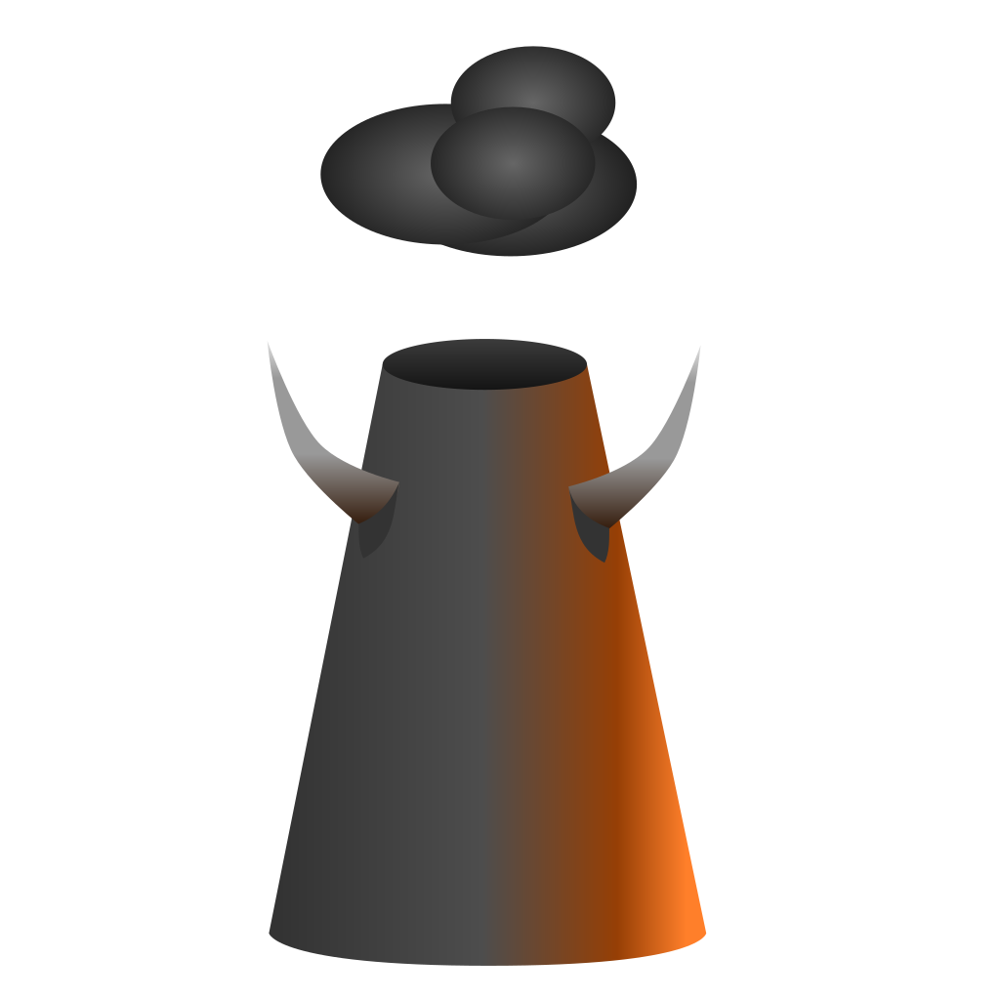

# Indusferno

Welcome to the home of Indusferno, a project that aims to bring a new,
unforeseen tycoon experience to ZDoom, with novel approaches to ZDoom
modding and open-source collaboration.

This is a partial conversion themed around the art of moving cargo
around, truly an industry in its own right.

This project is built using GDCC and ZDCode in a process that is
orchestrated by Ninja and Zake, respectively, and targets both ZDoom
and Zandronum 3.

The ultimate aim is to provide the first (and thus best) transportation
tycoon simulator for ZDoom. It is, of course, still themed around Doom,
but gameplay will be quite different.

